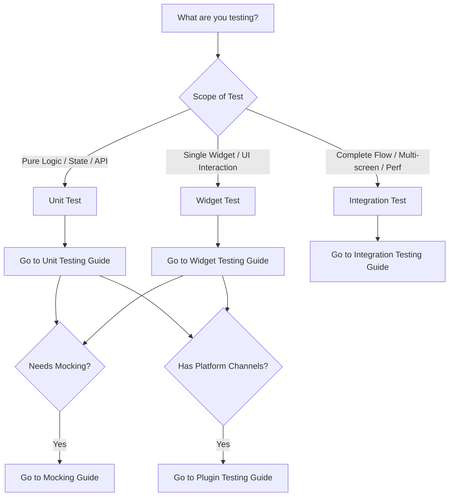

# Flutter Testing Router

## Goal
Select the appropriate testing strategy (unit, widget, or integration), implement it using best practices, and execute the tests using the most efficient tools.

## Testing Decision Tree

Use this decision tree to determine your testing strategy and find the appropriate reference guide:



### Reference Guides
*   **[Unit Testing Guide](references/unit-testing.md)**: In-depth unit testing patterns, async/stream testing, and lifecycle management.
*   **[Widget Testing Guide](references/widget-testing.md)**: Widget finders, simulated user interactions, orientation/scroll testing, and accessibility.
*   **[Integration Testing Guide](references/integration-testing.md)**: End-to-end user flows, performance profiling, and CI/CD integration.
*   **[Mocking Guide](references/mocking.md)**: Mockito usage, manual mocks, mocking platform channels, and state management.
*   **[Plugin Testing Guide](references/plugin-testing.md)**: Testing Flutter plugins containing native code (Android/iOS).
*   **[Common Errors Guide](references/common-errors.md)**: Solutions for layout overflows, vertical viewport issues, and async test failures.
*   **[Dart Test Matchers Guide](references/dart-test-matchers.md)**: Best practices for `package:test` matchers and declarative assertions using `package:checks`.

---

## Running and Analyzing Tests

### 1. Preferred Approach (MCP Tools)
Always prefer using the registered MCP tools for running tests and analyzing code, as they are optimized for the agent environment:
*   **Run Tests**: Use the Dart MCP `run_tests` tool. It automatically detects if it is a Flutter or Dart package and runs the tests accordingly.
*   **Analyze Code**: Use the Dart MCP `analyze_files` tool to check for analyzer problems and solve them before running tests.

### 2. Fallback Approach (Standard CLI)
If the specialized MCP tools are not available, use the standard Flutter CLI commands in the terminal:

*   **Run All Tests**:
    ```bash
    flutter test
    ```
*   **Run Specific Test File**:
    ```bash
    flutter test test/path_to_test.dart
    ```
*   **Run Integration Tests**:
    ```bash
    flutter test integration_test/
    ```
*   **Run with Coverage**:
    ```bash
    flutter test --coverage
    ```
*   **Run Specific Test by Name**:
    ```bash
    flutter test --name "your test name"
    ```

---

## General Constraints and Best Practices

*   **Write Tests First / Proactively**: When implementing features, proactively offer to write regression or feature tests.
*   **No UI in Unit Tests**: Never import `package:flutter/material.dart` or attempt to render widgets in unit tests.
*   **Mock Network/IO**: All unit and widget tests must mock network requests and disk I/O to ensure they are hermetic and fast.
*   **Clean Up Resources**: Always close `ReceivePort`s, controllers, and streams in `tearDown` to prevent leaks.
*   **Leverage package:checks**: Consider using the modern `package:checks` library for declarative and readable assertions (see the [matcher-to-checks](../matcher-to-checks/SKILL.md) skill).
